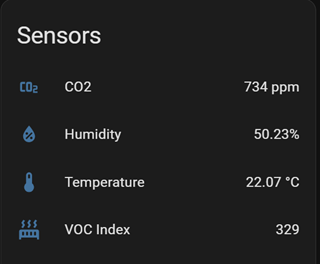

# 🌬️ ESPHome Air Quality Monitor

<p align="center">
  
</p>

<p align="center">
  <a href="https://esphome.io/"></a>
  <a href="https://www.home-assistant.io/"></a>
  <a href="LICENSE"></a>
</p>

<p align="center">
  <strong>A beautiful, touchscreen air quality monitor built with ESPHome & LVGL</strong><br>
  Optimized for the ESP32-2432S028 "Cheap Yellow Display" (CYD) with NO PSRAM
</p>

---

## ✨ Features

- **📊 Real-time Monitoring** — CO2, Temperature, Humidity, and VOC Index
- **🎨 Modern LVGL UI** — Clean, dark-themed interface optimized for glanceability
- **📱 Touch Controls** — Tap to wake, adjustable brightness
- **🏠 Home Assistant Integration** — Full entity support with diagnostics
- **💾 Memory Optimized** — Runs stable on ESP32 with only ~45-50KB LVGL footprint
- **🔄 Anti Burn-in** — Automatic pixel exercising to prevent LCD image retention
- **⏰ Auto Maintenance** — Weekly scheduled reboots for long-term stability

## 📷 Screenshots

| Main Display | Home Assistant |
|:---:|:---:|
|  |  |

## 🛠️ Hardware Requirements

### Core Components

| Component | Model | Purpose |
|-----------|-------|---------|
| Display Board | **ESP32-2432S028** (CYD) | Main controller + 2.8" 320×240 TFT |
| CO2 Sensor | **SCD40** or **SCD41** | CO2, Temperature, Humidity |
| VOC Sensor | **SGP40** or **SGP41** | Volatile Organic Compounds Index |

### 3D Printed Case

📦 **[Download the case on Printables](https://www.printables.com/model/1586920-cyd-cheap-yellow-display-modular-mod-rear)**

The modular rear case design allows easy sensor integration and wall mounting.

### Wiring Diagram

```
ESP32-2432S028 (CYD)          Sensors
┌─────────────────────┐       ┌─────────────────┐
│                     │       │    SCD4x        │
│  GPIO 27 (SDA) ─────┼───────┼─── SDA          │
│  GPIO 22 (SCL) ─────┼───────┼─── SCL          │
│  3.3V ──────────────┼───────┼─── VCC          │
│  GND ───────────────┼───────┼─── GND          │
│                     │       └─────────────────┘
│                     │       ┌─────────────────┐
│  GPIO 27 (SDA) ─────┼───────┼─── SDA  SGP4x   │
│  GPIO 22 (SCL) ─────┼───────┼─── SCL          │
│  3.3V ──────────────┼───────┼─── VCC          │
│  GND ───────────────┼───────┼─── GND          │
└─────────────────────┘       └─────────────────┘
```

> **Note:** Both sensors share the same I2C bus (different addresses)

## 🚀 Installation

### 1. Clone the Repository

```bash
git clone https://github.com/el-bakkali/esphome-air-quality-monitor.git
cd esphome-air-quality-monitor
```

### 2. Configure Secrets

Copy the example secrets file and fill in your credentials:

```bash
cp secrets.yaml.example secrets.yaml
```

Edit `secrets.yaml` with your values:

```yaml
wifi_ssid: "YourWiFiNetwork"
wifi_password: "YourWiFiPassword"
api_encryption_key: "your-32-byte-base64-key"
ota_password: "your-ota-password"
ap_password: "fallback-ap-password"
```

> **Tip:** Generate an API encryption key with:
> ```bash
> openssl rand -base64 32
> ```

### 3. Flash to Device

Using ESPHome CLI:

```bash
esphome run air-quality-monitor.yaml
```

Or via the ESPHome Dashboard in Home Assistant.

### 4. Calibrate (Optional)

**Temperature Offset:** The SCD4x sensor tends to read high due to self-heating. Adjust `temperature_offset` in the YAML (default: 6.0°C).

**Touchscreen Calibration:** If touch is inaccurate, adjust the calibration values:
```yaml
calibration:
  x_min: 280    # Adjust these values
  x_max: 3860
  y_min: 340
  y_max: 3860
```

## 📊 Understanding the Readings

### CO2 Levels
| Level | Range (ppm) | Description |
|-------|-------------|-------------|
| 🟢 **GOOD** | < 800 | Excellent air quality |
| 🟡 **FAIR** | 800 - 1200 | Acceptable, consider ventilation |
| 🔴 **POOR** | > 1200 | Poor air quality, ventilate immediately |

### VOC Index
| Level | Range | Description |
|-------|-------|-------------|
| 🟢 **Good** | ≤ 150 | Normal/baseline levels |
| 🟡 **Moderate** | 150 - 250 | Elevated, check for sources |
| 🔴 **High** | > 250 | High VOC detected |

## ⚙️ Configuration

### Key Settings

| Setting | Default | Description |
|---------|---------|-------------|
| `update_interval` | 30s | Sensor polling frequency |
| `temperature_offset` | 6.0°C | Compensation for sensor self-heating |
| `altitude_compensation` | 20m | Your altitude above sea level |
| `timezone` | Europe/London | Your local timezone |
| `buffer_size` | 25% | LVGL display buffer (optimal for no PSRAM) |

### Display Timeout

The screen dims automatically to save power and reduce burn-in:
- **60 seconds:** Dims to 50%
- **5 minutes:** Dims to 20%

Touch the screen to wake it at full brightness.

### Anti Burn-in

A "snow/static" effect runs automatically at 2 AM for 15 minutes to exercise all pixels. You can also trigger it manually via Home Assistant using the **Anti Burn-in** switch.

## 🏠 Home Assistant Entities

Once connected, the following entities are available:

### Sensors
- `sensor.air_quality_monitor_co2`
- `sensor.air_quality_monitor_temperature`
- `sensor.air_quality_monitor_humidity`
- `sensor.air_quality_monitor_voc_index`

### Controls
- `light.air_quality_monitor_display_backlight`
- `number.air_quality_monitor_display_brightness`
- `switch.air_quality_monitor_anti_burn_in`

### Diagnostics
- `sensor.air_quality_monitor_free_heap`
- `sensor.air_quality_monitor_wifi_signal`
- `sensor.air_quality_monitor_uptime`

## 🔧 Memory Optimization Notes

This configuration is specifically optimized for ESP32 boards **without PSRAM**:

- **LVGL Buffer:** 25% (38KB) — Sweet spot for no-PSRAM devices
- **Flat Widget Layout:** No nested containers, reduces object overhead
- **ESP-IDF Optimizations:** Disabled IRAM features save ~15KB
- **Minimal Logging:** Reduced to WARN level for memory savings

Typical memory usage:
- **Free Heap:** ~80-100KB available
- **Largest Block:** ~40-60KB
- **Loop Time:** <50ms typical

## 🐛 Troubleshooting

### Display shows "MEM!"
The heap memory dropped below 30KB. This indicates a memory leak or fragmentation. The device will likely need a restart. Check the logs for memory warnings.

### Flickering or slow updates
- Reduce `buffer_size` to 15% if you see issues
- Ensure `update_interval: never` is set for the display
- Check that no unintended animations are running

### Sensors not responding
- Verify I2C wiring (SDA=GPIO27, SCL=GPIO22)
- Check sensor addresses aren't conflicting
- Try reducing I2C frequency to 50kHz

### Touch not working
- Verify SPI wiring for the XPT2046
- Adjust `threshold` value (lower = more sensitive)
- Recalibrate x_min/x_max/y_min/y_max values

## 📝 License

This project is licensed under the MIT License — see the [LICENSE](LICENSE) file for details.

## 🙏 Acknowledgments

- [ESPHome](https://esphome.io/) — The amazing platform making this possible
- [LVGL](https://lvgl.io/) — Beautiful graphics library
- [Cheap Yellow Display Community](https://github.com/witnessmenow/ESP32-Cheap-Yellow-Display) — For CYD documentation
- [Printables Community](https://www.printables.com/) — For the 3D printed case

---

<p align="center">
  Made with ❤️ for cleaner air
</p>
